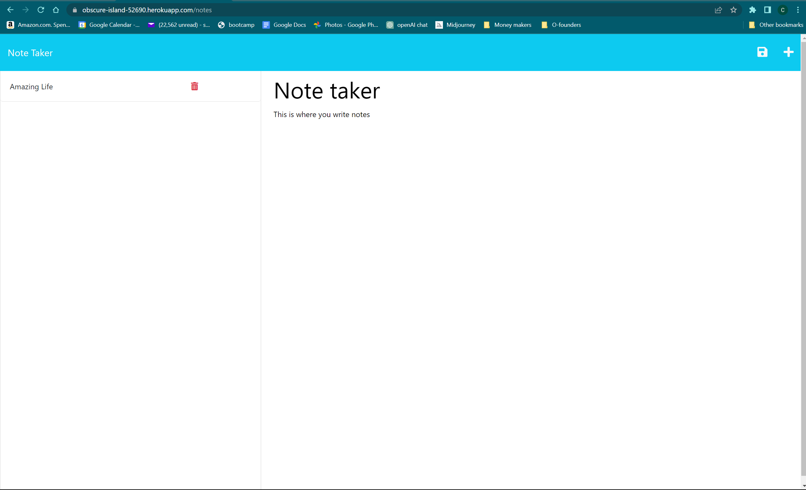
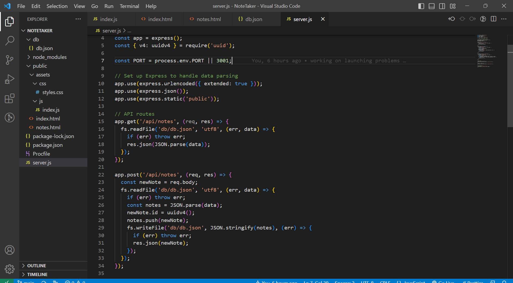

# Note Taker 

## Description

This is a note taker that uses Express.js and JSON to accept and save notes

## Table of Contents

- [Usage](#usage)
- [Images](#images)

- [Questions](#questions)

## Usage

 [Click here](https://obscure-island-52690.herokuapp.com/) to go to my deployed site. Then click on the get started button and you will be directed to a page that allows you to title and write your notes. When you are done writing your note hit the button to save in the top right corner. To recall notes you can click on them on the list on the left side or you can delete them by clicking on the trash can. 

## Images
This is what my deployed site looks like 

This is what some of my code looks like for the Note Taker site.

## Questions

For questions, please contact:

- Email: smilie_kay@yahoo.com
- GitHub: github.com/SmilieKay
